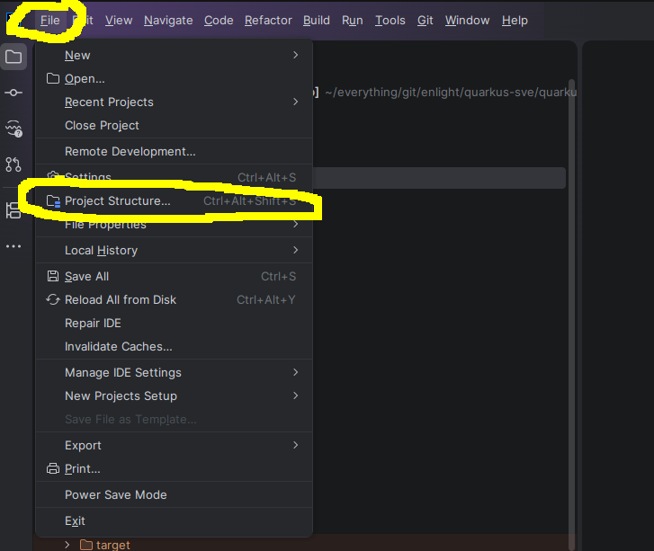
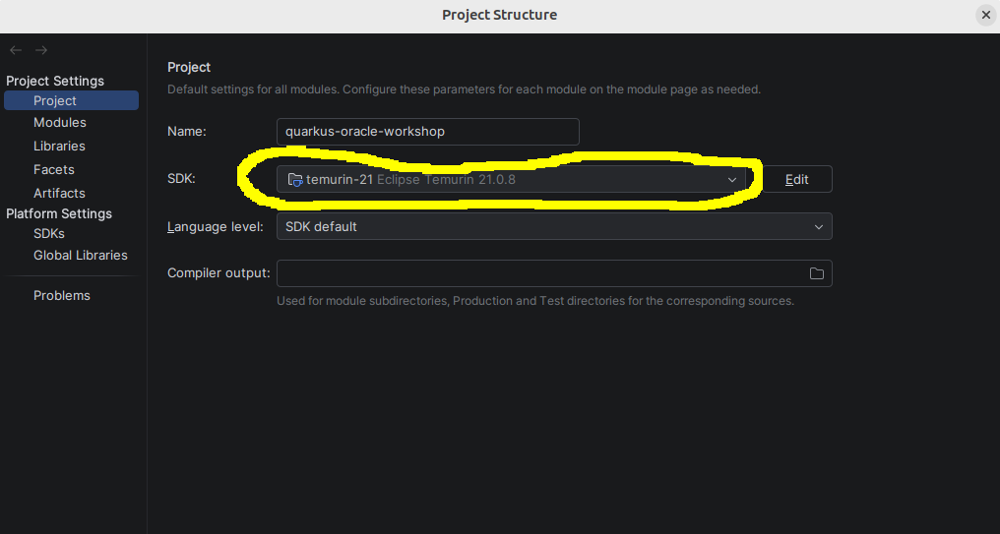
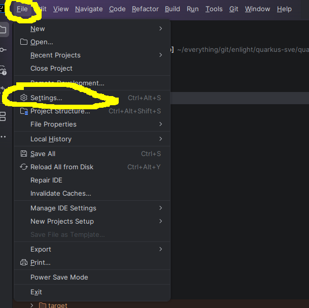
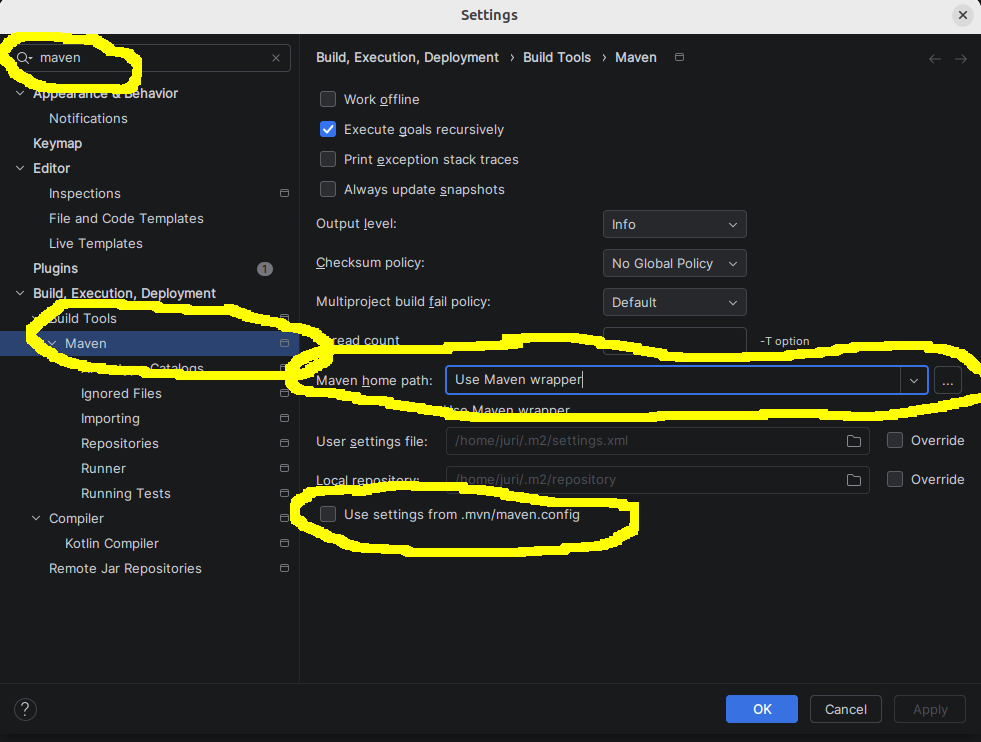

# Quarkus Book-first Oracle Workshop Demo

This is a beginner-friendly training project for colleagues who already know Oracle and want to learn how a Java backend calls Oracle from REST APIs with Quarkus.

The project focuses on:
- Understanding REST + JSON request/response
- Seeing the backend flow for a request
- Plain JDBC + Agroal in a clear, beginner-friendly setup
- Clear code over clever abstractions

## What this project contains

- A simple `Book` example first (`/api/books`) for REST basics
- Plain JDBC/Oracle integration (no Hibernate, Panache, JPA)
- SQL scripts for Oracle setup under `sql/`
- Ready-to-run request examples in `requests/`

## Prerequisites

- Java 21
- IntelliJ IDEA Community
- Maven (`./mvnw` wrapper is included)
- Oracle Database Free (Docker)
- Insomnia
- (Optional for DB demo) SQL client for running scripts under `sql/`

## IntelliJ quick setup (Java + Maven)

If IntelliJ opens the project without the correct JDK or Maven setup, do this once before running the app:

1. Open `File -> Project Structure...`
2. In `Project`, set `SDK` to your installed Java 21 and leave `Language level` as `SDK default`.
3. Open `File -> Settings...`
4. Search for `Maven` and open `Build, Execution, Deployment -> Build Tools -> Maven`.
5. Set `Maven home path` to `Use Maven wrapper`.
6. Enable `Use settings from .mvn/maven.config`.

### Java setup

Open `Project Structure` from the `File` menu:



Set the project SDK to Java 21:



### Maven setup

Open `Settings` from the `File` menu:



Set Maven to use the wrapper:



## How to run

From project root:

```bash
./mvnw quarkus:dev
```

The app starts on:

- `http://localhost:8080`

Swagger/OpenAPI UI is not enabled by default to keep the project simpler.

## Configure Oracle connection

Edit `src/main/resources/application.properties` and change:

- `quarkus.datasource.username`
- `quarkus.datasource.password`
- `quarkus.datasource.jdbc.url`

The default template uses environment variables:

- `DB_USERNAME`
- `DB_PASSWORD`
- `DB_URL`

Example URL format:

```properties
quarkus.datasource.jdbc.url=jdbc:oracle:thin:@//localhost:1521/FREEPDB1
```

## Database bootstrap on startup

The app now creates the `BOOK` table automatically on startup by running SQL scripts from:

- `src/main/resources/sql/01_book_schema.sql`
- `src/main/resources/sql/02_book_data.sql`

Behavior:
- `BOOK` table is created if it does not exist.
- Sample rows are inserted only when they are not already there.
- Script execution is plain JDBC and runs via a small startup bean.

Config:
- `demo.db-bootstrap.enabled=true` (default)
- set `DB_BOOTSTRAP_ENABLED=false` or the property value to `false` to skip startup bootstrap (for test/dev cases).

## Endpoints

### Book intro

- `GET /api/books` – list books
- `GET /api/books/{id}` – get one book by id
- `POST /api/books` – insert one row into `BOOK` and return generated `id`
- `DELETE /api/books/{id}` – delete one book row
- `GET /api/books/search?author=...` – search books by author

The Book demo uses the real `BOOK` table in Oracle through plain JDBC, not an in-memory list.

## Sample requests (curl)

```bash
curl -X GET http://localhost:8080/api/books
```

```bash
curl -X GET http://localhost:8080/api/books/1
```

```bash
curl -X POST http://localhost:8080/api/books \
  -H "Content-Type: application/json" \
  -d '{"title":"Effective Java","author":"Joshua Bloch","isbn":"9780134685991","category":"Java"}'
```

```bash
curl -X GET "http://localhost:8080/api/books/search?author=Bloch"
```

```bash
curl -X DELETE http://localhost:8080/api/books/1
```

## Folder structure

- `src/main/java/com/enlight/demo/common` – shared error handling
- `src/main/java/com/enlight/demo/config` – workshop properties
- `src/main/java/com/enlight/demo/book` – Book intro domain
- `src/main/java/com/enlight/demo/db` – database bootstrap helper
- `src/main/resources/application.properties` – datasource and demo settings
- `sql/` – manual setup SQL for the workshop (`schema.sql`, `data.sql`)
- `src/main/resources/sql/` – startup bootstrap scripts for `BOOK` (`01_book_schema.sql`, `02_book_data.sql`)
- `requests/` – ready API samples for manual HTTP checks

## Workshop flow suggestion

1. Start with `/api/books` endpoints to explain:
   - JSON request/response
   - route mapping (`GET`, `POST`, path params)
   - simple validation and error payload
2. Continue with request/response behavior and SQL-backed responses.

## Project intentionally keeps complexity low

- No Hibernate ORM, no Panache, no JPA
- No complex repositories or abstractions
- Explicit, beginner-friendly Java classes and comments
- Error handling is simple and readable

## Testing note

This workshop repo does not include project-specific test classes. Use manual request checks from `requests/` and your HTTP client during the workshop.

Before zipping/sharing the project, remove build artifacts (`target/`) so learners get a clean workshop repo.

# Docker compose
docker login container-registry.oracle.com  # first time only, if required
docker compose up -d
docker compose logs -f oracle-free

Notes:
- The first Oracle startup is slow; wait until the logs show database creation completed.
- If you change `ORACLE_PDB` in compose, update `DB_URL` to `//localhost:1521/<your_pdb>` in `application.properties`.
- App default connection settings are:
  - DB_USERNAME=system
  - DB_PASSWORD=demo_password
  - DB_URL=jdbc:oracle:thin:@//localhost:1521/FREEPDB1

## ORA-01017 during app startup (`invalid credentials`)

This is usually authentication-related, not JDBC/driver-related.

Quick checks:

1. Stop and start with a clean startup output:
   - `docker compose logs -f oracle-free`
2. Test credentials directly from the default account:
   - `DB_URL=jdbc:oracle:thin:@//localhost:1521/FREEPDB1`
   - `DB_USERNAME=system`
   - `DB_PASSWORD=demo_password`

If login still fails, reset credentials in the DB:

```sql
ALTER SESSION SET CONTAINER = FREEPDB1;
ALTER USER system IDENTIFIED BY demo_password;
ALTER USER system ACCOUNT UNLOCK;
GRANT CREATE SESSION TO system;
```

Then rerun Quarkus with:

```bash
export DB_USERNAME=system
export DB_PASSWORD=demo_password
./mvnw quarkus:dev
```

### DBVisualizer quick fix (same error there too)

In DBVisualizer, make sure all three are set explicitly:
- Connection type: **Connect as service** (not SID)
- Service name: `FREEPDB1`
- Username/password: `system` / `demo_password`

If DBVisualizer keeps asking for credentials on each connect, remove/recreate that connection and enter the password again (it can keep stale cached credentials).

## Bonus gRPC demo (small workshop addition)

This project keeps **REST as the main API**, and also includes a small gRPC example around the same `Book` domain.

Example overview:

- `BookService` in `src/main/proto/book_service.proto`
- gRPC unary method: `GetBookById`
- gRPC implementation: `src/main/java/com/enlight/demo/book/BookGrpcService.java`
- Small REST wrapper sample for easy workshop comparison: `GET /api/books/grpc/{id}` in
  `src/main/java/com/enlight/demo/book/BookGrpcResource.java`
- REST app still runs on port `8080`, gRPC demo on port `9000`
- Insomnia collection includes a direct gRPC request with portable proto tree resolving to
  `src/main/proto/book_service.proto` under
  `api-clients/insomnia/quarkus-oracle-workshop-insomnia.json`
- Full walkthrough (what is gRPC, how .proto works, how to test): `GRPC_BOOK_DEMO.md`
